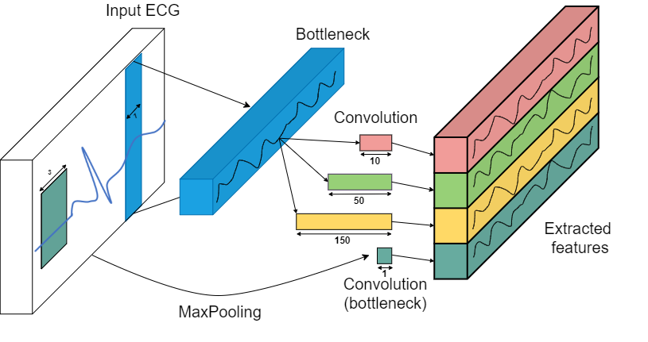

# Robust deep learning pipeline for PVC beats localization

Premature ventricular contraction(PVC) is among the most frequently occurring types of arrhythmias. Along with other cardiovascular diseases, it may easily cause hazardous health conditions, making PVC detection task extremely important in cardiac care. However, the long-term nature of monitoring, sophisticated morphological features, and patient variability makes the manual observation of PVC an impractical task. Existing approaches for automated PVC identification suffer from a range of disadvantages. These include domain-specific handcrafted features, usage of manually delineated R peaks locations, tested on a tiny sample of PVC beats(usually a small subset of MIT-BIH database). We address some of these drawbacks in proposed  framework, which takes a raw ECG signal as an input and localizes R peaks of the PVC beats. It consists of two neural networks. The first one is an encoder-decoder architecture that localizes the R peak of both Normal and anomalous heartbeats. Provided R peaks positions, our CardioIncNet model, adopted for ECG signal data, does the delineation of healthy versus PVC bits. We have performed the extensive evaluation of our pipeline with both single- and cross-dataset paradigms on three public datasets. Our approach results in over 0.99 and 0.979 F1-measure on both single- and cross-dataset paradigms for R peaks localization task and above 0.96 and 0.85 F1 score for the PVC beats classification task.

### R-peaks segmentation

### PVC beats classification 

